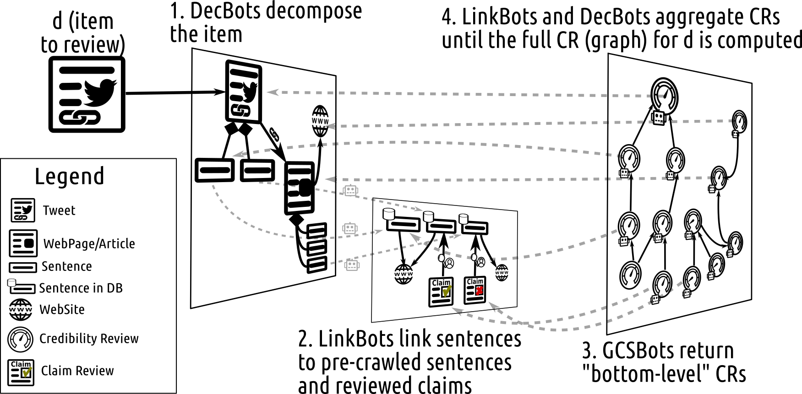

# acred: review the credibility of web content

Implements a number of AI bots to automatically **review and explain** the credibility of web content such as articles, tweets, sentences and websites.

## Example Reviews
	
### Not credible
> Article ["Clinton Body Count Series #5: Woman Set to Testify Against Clintons Blown Up in Home Explosion"](https://thegoldwater.com/news/30915-Clinton-Body-Count-Series-5-Woman-Set-to-Testify-Against-Clintons-Blown-Up-in-Home-Explosion) seems *not credible* like its least credible Sentence `Shawn Lucas Who Filed Fraud Case Against DNC and Hillary Found Dead!` which *agrees* with:
> 
> * `An FBI agent who exposed Hillary Clinton's corruption has been found dead.` that seems *not credible* based on [fact-check](https://www.snopes.com/fact-check/raynor-died-expose-clinton/) by [snopes](http://www.snopes.com/) with textual claim-review rating 'false'

> Article ["Bill Gates Outlines 2018 Plan To Depopulate The Planet"](http://www.mysterious-times.com/2018/04/30/bill-gates-outlines-2018-plan-to-depopulate-the-planet/) seems *not credible* like its least credible Sentence `Make no mistake, when Gates talks about making people healthier, what he is really talking about is enforcing the mandatory roll out of his range of experimental vaccinations.` which *agrees* with:
>
> * `Bill Gates has openly admitted that vaccinations are designed so that governments can depopulate the world.` that seems *not credible* based on [fact-check](https://www.snopes.com/fact-check/bill-gates-vaccinations-depopulation/) by [snopes](http://www.snopes.com/) with textual claim-review rating 'false'.

### Credible

> Article ["Obama Urges Bernanke, Paulson to Fight Foreclosures, Hold Homeownership Summit"](https://web.archive.org/web/20070613045339/http://obama.senate.gov/press/070322-obama_urges_ber/) seems *credible* like its least credible Sentence `WASHINGTON, DC -- U.S. Senator Barack Obama today sent a letter to Federal Reserve Chairman Bernanke and Treasury Secretary Paulson urging them to immediately convene a homeownership preservation summit with key stakeholders to fight foreclosures driven by growth in the subprime mortgage market.` which *agrees* with:
>
> * `'Two years ago...I wrote to Secretary Paulson, I wrote to Federal Reserve Chairman Bernanke, and told them [subprime lending] is something we have to deal with.'` that seems *credible* based on [fact-check](http://www.politifact.com/truth-o-meter/statements/2008/oct/08/barack-obama/obama-sounded-the-alarm-on-subprimes/) by [politifact](http://www.politifact.com/) with textual claim-review rating 'true'

### Uncertain

TODO

## How does it work?

## How well does it work?

As good as any automated system as of August 2020 :mechanical_arm:, which is not that great :frowning_face:.

As of August 2020, `acred` achieves state of the art performance on:
* [Clef'18 CheckThat! Factuality](http://alt.qcri.org/clef2018-factcheck/index.php?id=factuality)
* [FakeNewsNet](https://github.com/KaiDMML/FakeNewsNet) (the PolitiFact articles fragment)
* [coinform250](https://github.com/co-inform/Datasets/blob/master/system_dataset_with5.csv)

State-of-the-art performance sounds (and is) good, but you only need to play around with the system a short while before you'll see many incorrect labels and explanations which are clearly incorrect. This is still very much a research prototype and you should not rely solely on the output of `acred`. Having said that, the overall architecture seems sound and easily extensible and assuming (i) progress in the underlying NLP tasks (semantic similarity, stance and checkworthiness detection) and (ii) an up-to-date and high-quality database of fact-checked claims; we expect `acred` to be able to evolve into a production-ready library.

# Further details

See our paper [Linked Credibility Reviews for Explainable Misinformation Detection]() to appear at the [International Semantic Web Conference 2020](https://iswc2020.semanticweb.org/).

